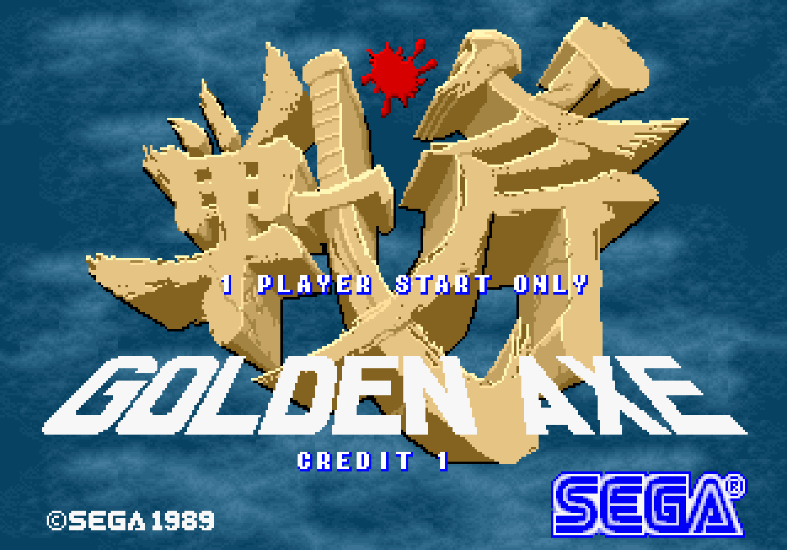
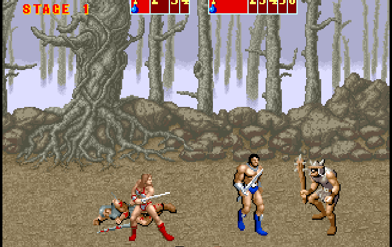

<p align="center">
  
</p>

# 🪓 Golden Axe Resurrection
### A full revival ROM kit for the Sega *Golden Axe* arcade PCB

Bring dead Golden Axe boards back to life by replacing the encrypted Sega MC68000 CPU and protected ROMs with clean, unencrypted Resurrection ROMs.

---

## 📜 Overview

Golden Axe arcade hardware uses a battery-backed encryption module.  
When the battery dies, the board becomes non-functional.

This project provides:

- CPU replacement instructions  
- Resurrection ROMs  
- JAMMA conversion notes  
- Photos and documentation

---

## 🧠 CPU & ROM Replacement

See:

- `/Docs/CPU_Replacement.md`  
- `/Docs/ROM_Programming.md`

---

## 🎮 JAMMA Conversion

See `/Docs/JAMMA_Conversion.md`.

---

## 🖼️ Screenshots

<p float="left">
  
  
</p>

---

## 📁 Repository Structure

```
/ROMs
/Images
/Docs
README.md
```

---

## 👾 Preservation

This project exists to keep classic arcade hardware preserved.  
Contributions welcome.


